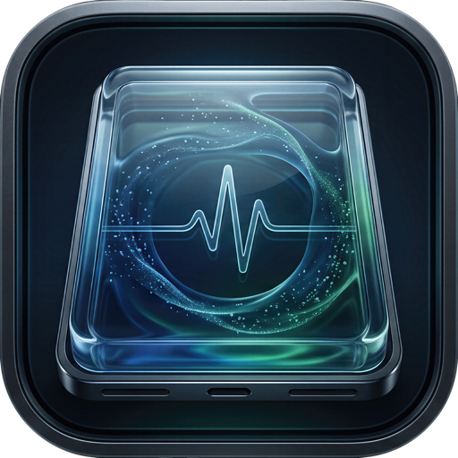

<p align="center">
  
</p>

<h1 align="center">SHIXIN LAB · 「存迹」MacDisk Health</h1>

<p align="center">
  本地优先的 macOS SMART / NVMe 硬盘健康工具<br>
  A local-first SMART / NVMe disk-health utility for macOS
</p>

<p align="center">
  <a href="https://github.com/ShiXinQvQ/SHIXIN-LAB-CunJi-MacDisk-Health/releases/latest"><strong>Download / 下载</strong></a>
  ·
  <a href="https://shixinqvq.com/lab/macdisk/">Product Page / 产品官网</a>
  ·
  <a href="SECURITY.md">Security / 安全</a>
  ·
  <a href="Docs/ARCHITECTURE.md">Architecture / 架构</a>
  ·
  <a href="CONTRIBUTING.md">Contributing / 参与贡献</a>
</p>

<p align="center">
  
  
  
  
  
</p>

`SHIXIN LAB · 「存迹」MacDisk Health` is a local-first native macOS SwiftUI utility for reading Mac internal and local external disk SMART / NVMe health data, reviewing per-disk snapshots and trends, running user-confirmed ordinary-file speed tests, and inspecting the local Mac hardware profile.

It is an official SHIXIN LAB project by Shixin (`失心` / `ShiXinQvQ`). SHIXIN LAB is Shixin's personal technology lab and product identity for independent software, hardware, creator tools, and digital experiments.

- Product page: [https://shixinqvq.com/lab/macdisk/](https://shixinqvq.com/lab/macdisk/)
- SHIXIN LAB website: [https://shixinqvq.com/](https://shixinqvq.com/)
- Product name: `SHIXIN LAB · 「存迹」MacDisk Health`
- Chinese short name: `存迹`
- Chinese display name: `SHIXIN LAB · 「存迹」`
- Subtitle: `MacDisk Health · SMART / NVMe`
- Published app Bundle ID: `com.shixinqvq.shixinlab.diskhealth`
- Current release: `0.2.0` (build `6`)
- Minimum macOS: `15.0+`
- Architecture: Apple Silicon / `arm64`

[中文说明见下方](#中文说明)

## Download

The current official release is `0.2.0` (build `6`).

- [Download the official v0.2.0 DMG](https://github.com/ShiXinQvQ/SHIXIN-LAB-CunJi-MacDisk-Health/releases/download/v0.2.0/SHIXIN-LAB-CunJi-MacDisk-Health-v0.2.0.dmg)
- [Release notes and verification files](https://github.com/ShiXinQvQ/SHIXIN-LAB-CunJi-MacDisk-Health/releases/tag/v0.2.0)
- [SHA-256 checksum manifest](SHA256SUMS.txt)
- [Product page](https://shixinqvq.com/lab/macdisk/)

DMG SHA-256:

```text
3a4ea06f0571d533c12eda52a3acbb6fd54f9258ae036f028ea0b9cde0301aa5
```

Verify after downloading:

```bash
shasum -a 256 SHIXIN-LAB-CunJi-MacDisk-Health-v0.2.0.dmg
```

Use only the official product page or this repository's Releases page. A GitHub
source archive is source code, not the installable macOS app; macOS users should
download the `.dmg` asset above.

The current release package uses a local ad-hoc signature. macOS may show an
"unverified developer" warning on first launch.

## What It Does

- Enumerates local whole-disk devices and reads internal or local external disk SMART data through a fixed read-only `smartctl` policy.
- Presents protocol-appropriate NVMe, ATA/SATA, and SCSI/SAS health data instead of applying NVMe-only conclusions to every disk.
- Separates disk health from read completeness, so Apple SSD supplemental log failures do not become false disk-health warnings.
- Saves local SMART snapshots per disk and compares the current report with the previous saved snapshot for the same disk identity.
- Shows historical trends and exports history to JSON / CSV with a device-information warning.
- Runs a separate speed test using Swift / Foundation ordinary file I/O only after explicit user confirmation.
- Saves speed test history, charts, and JSON / CSV exports with target volume identity while avoiding the full custom test-folder path.
- Shows a local Mac hardware profile with serial number, Provisioning UDID, and platform UUID hidden by default.
- Provides English, Simplified Chinese, and Japanese interface resources.
- Bundles `smartmontools / smartctl` with license notices for local distribution.

## Safety Boundaries

This app is a health viewer and local diagnostic utility, not a disk repair tool.

The SMART module is read-only. It does not format, repair, mount, unmount, erase, sanitize, secure-erase, write raw disks, or execute arbitrary shell commands.

The only allowed SMART command shapes are fixed read-only forms for enumerated whole-disk device nodes. The app rejects partitions, `rdisk`, user-typed raw paths, shell execution, and arbitrary smartctl arguments.

```bash
smartctl [fixed -d type] -i -H -A --json /dev/diskN
smartctl [fixed -d type] -a --json /dev/diskN
```

The fixed type is omitted for Auto, or is one of `nvme`, `sat`, `scsi`, `sntasmedia`, `sntjmicron`, and `sntrealtek` when the enumerated hardware profile permits it. All SMART reads go through `SmartctlRunner`, which validates the executable name, whole-disk target, fixed type, and exact argument list before launching `smartctl`.

External SMART availability still depends on macOS, the physical disk, and the USB / Thunderbolt bridge. A disk can be enumerated and remain fully usable for ordinary-file speed testing even when its enclosure does not expose SMART. In that case the app reports SMART as unavailable and does not reuse or relabel another disk's report.

The Speed Test module is intentionally separate from SMART reads. It only creates a fixed-size ordinary temporary file in the app cache directory or a user-selected ordinary folder after explicit confirmation, measures sequential write/read speed with Swift native file I/O, then removes the file.

The Speed Test module does not write to `/dev/disk0`, external raw devices, or any raw `/dev/*` device. It does not use `dd`, shell, `diskutil`, `fsck`, mount/unmount, repair, erase, or format commands. Network volumes can be selected only as ordinary file-system speed-test targets; they are never treated as SMART-readable disks.

The “This Mac” hardware-profile module uses fixed read-only system queries, including `/usr/sbin/system_profiler` JSON output and Darwin `sysctl` reads. It is not an arbitrary command runner.

## Privacy

The app does not upload disk information, does not run background network sync, and does not save administrator passwords. The only network-adjacent action is opening the SHIXIN LAB website in the user's default browser after the user clicks the website link.

Local data is stored under the user's Library folder:

```text
~/Library/Application Support/SHIXIN LAB MacDisk Health/snapshots.json
~/Library/Application Support/SHIXIN LAB MacDisk Health/speed-tests.json
~/Library/Application Support/SHIXIN LAB MacDisk Health/speed-test-incomplete.json
~/Library/Caches/SHIXIN LAB MacDisk Health/SpeedTest/
```

SMART history keeps the full local snapshot data so reports can be reviewed later. The interface hides serial numbers by default. Raw SMART JSON is redacted by default, and export warns before writing files because an explicitly exported report can contain device identity and health metadata.

The hardware profile view hides serial number, Provisioning UDID, and platform UUID by default. Users can reveal them locally for self-checking, but screenshots and logs should be shared carefully.

## Open Source Components

This release package bundles `smartmontools / smartctl`:

- Component: `smartmontools / smartctl`
- Bundled version: `smartctl 7.5`
- Upstream: [https://www.smartmontools.org/](https://www.smartmontools.org/)
- Source mirror: [https://github.com/smartmontools/smartmontools](https://github.com/smartmontools/smartmontools)
- License: GPL-2.0-or-later
- Notices and corresponding source: see `Licenses/`

`smartctl` is an upstream open-source component and is not proprietary SHIXIN LAB code. This app invokes it only through fixed read-only argument whitelists.

## Build From Source

Requirements:

- macOS 15+
- Swift 6 toolchain
- Apple Silicon Mac for the current release target
- `smartctl` available locally, or bundled into the app resources for distribution

Run the self tests:

```bash
swift run ShixinDiskHealthSelfTest
swift run ShixinDiskHealthSelfTest --live
```

Run the app during development:

```bash
swift run ShixinDiskHealth
```

Build the final 0.2.0 main `.app`:

```bash
SHIXIN_DISK_HEALTH_VARIANT=main \
SHIXIN_DISK_HEALTH_ALLOW_MAIN_BUILD=YES \
SHIXIN_DISK_HEALTH_SHORT_VERSION=0.2.0 \
SHIXIN_DISK_HEALTH_BUNDLE_VERSION=6 \
SHIXIN_DISK_HEALTH_INCLUDE_HELPER=NO \
Scripts/build-app.sh
```

The script still defaults to the isolated legacy-v2 identity as a safety guard.
It refuses to build the published main identity unless explicit main-build
authorization, short-version, and bundle-version variables are all supplied.

Generate the final 0.2.0 share package:

```bash
SHIXIN_DISK_HEALTH_VARIANT=main \
SHIXIN_DISK_HEALTH_ALLOW_MAIN_PACKAGE=YES \
SHIXIN_DISK_HEALTH_SHORT_VERSION=0.2.0 \
SHIXIN_DISK_HEALTH_BUNDLE_VERSION=6 \
SHIXIN_DISK_HEALTH_PACKAGE_VERSION=v0.2.0 \
Scripts/package-share.sh
```

The package includes bilingual install guides, product/copyright information,
release notes, the SHIXIN LAB GPL and brand-policy documents, smartmontools
license files, and the corresponding smartmontools 7.5 source archive. It
validates and mounts the DMG, tests ZIP integrity, and writes a relative-path
`SHA256SUMS.txt` under `Dist/`.

For the component layout, data flow, release identity, and inactive helper
boundary, see [`Docs/ARCHITECTURE.md`](Docs/ARCHITECTURE.md).

## Distribution Status

Version `0.2.0` (build `6`) is the current formal release. GitHub Releases is the
versioned binary archive and checksum source; the SHIXIN LAB product page is the
official product introduction and download entry. The local package script
builds and validates release artifacts but never publishes them automatically.

## License

SHIXIN LAB-owned source code and documentation are free and open-source software
under **GNU GPL-3.0-or-later**. You may use, study, modify, and redistribute the
code under that license; distributed modified versions must remain available
under compatible GPL terms.

The `SHIXIN LAB` and `存迹 / CunJi` names, logos, app icons, and other brand
identifiers are not granted under the GPL. Modified or unofficial distributions
must use a clearly different name and visual identity and must not imply SHIXIN
LAB endorsement. See [`COPYRIGHT.md`](COPYRIGHT.md) and
[`TRADEMARKS.md`](TRADEMARKS.md).

Bundled third-party components keep their own licenses. In particular,
`smartmontools / smartctl` remains GPL-2.0-or-later; see `Licenses/`.

---

# 中文说明

`SHIXIN LAB · 「存迹」MacDisk Health`（中文短名：存迹）是一款本地优先的 macOS 原生 SwiftUI 工具，用于读取 Mac 内置与本地外置硬盘的 SMART / NVMe 健康数据，按硬盘查看历史快照、趋势、普通文件速度测试记录和本机硬件配置。

这是失心（`失心` / `ShiXinQvQ`）旗下 SHIXIN LAB 的官方项目。SHIXIN LAB 是失心个人 IP 下的技术实验室与产品标识，面向独立软件、硬件、创作者工具和数字实验项目。

- 产品官网：[https://shixinqvq.com/lab/macdisk/](https://shixinqvq.com/lab/macdisk/)
- SHIXIN LAB 官网：[https://shixinqvq.com/](https://shixinqvq.com/)
- 产品名称：`SHIXIN LAB · 「存迹」MacDisk Health`
- 中文短名：`存迹`
- 中文展示名：`SHIXIN LAB · 「存迹」`
- 副标题：`MacDisk Health · SMART / NVMe`
- 已发布 App Bundle ID：`com.shixinqvq.shixinlab.diskhealth`
- 当前发布版本：`0.2.0`（build `6`）
- 最低系统：`macOS 15.0+`
- 当前架构：Apple Silicon / `arm64`

## 下载

当前正式版本为 `0.2.0`（build `6`）。

- [下载官方 v0.2.0 DMG](https://github.com/ShiXinQvQ/SHIXIN-LAB-CunJi-MacDisk-Health/releases/download/v0.2.0/SHIXIN-LAB-CunJi-MacDisk-Health-v0.2.0.dmg)
- [查看版本说明与校验文件](https://github.com/ShiXinQvQ/SHIXIN-LAB-CunJi-MacDisk-Health/releases/tag/v0.2.0)
- [SHA-256 校验清单](SHA256SUMS.txt)
- [访问产品官网](https://shixinqvq.com/lab/macdisk/)

DMG SHA-256：

```text
3a4ea06f0571d533c12eda52a3acbb6fd54f9258ae036f028ea0b9cde0301aa5
```

下载后可在“终端”验证：

```bash
shasum -a 256 SHIXIN-LAB-CunJi-MacDisk-Health-v0.2.0.dmg
```

请只使用本仓库 Releases 页面或 SHIXIN LAB 官方产品页。GitHub 自动提供的
Source code 压缩包是源码，不是可以直接安装的 App；普通用户应下载上面的
`.dmg` 文件。

当前 0.2.0 正式包使用 ad-hoc 本地签名。首次打开时 macOS 可能提示“无法验证开发者”。

## 功能

- 枚举本机 whole-disk 设备，并通过固定只读策略读取内置或本地外置硬盘 SMART 数据。
- 按 NVMe、ATA/SATA、SCSI/SAS 协议展示适用的健康数据，不再把 NVMe 指标套用到所有硬盘。
- 将“硬盘健康”与“读取完整性”分开表达，避免 Apple SSD 附加日志不可读被误报为硬盘故障。
- 按硬盘身份保存本机 SMART 快照，并与同一硬盘的上一次保存快照对比。
- 展示历史趋势，并支持 JSON / CSV 导出。
- 提供独立速度测试模块，只在用户确认后使用 Swift / Foundation 普通文件 I/O 写入临时测试文件。
- 保存速度测试历史、趋势和 JSON / CSV 导出，记录目标卷身份，同时不保存用户自定义测试目录的完整路径。
- 展示本机硬件配置，默认隐藏序列号、Provisioning UDID 和平台 UUID。
- 提供英文、简体中文、日文界面资源。
- 本地正式包内置 `smartmontools / smartctl`，并随包提供许可证说明。

## 安全边界

本 App 是硬盘健康查看器和本地诊断工具，不是磁盘修复工具。

SMART 模块严格只读，不提供格式化、修复、挂载、卸载、擦除、安全擦除、raw disk 写入或任意 shell 命令能力。

SMART 读取只允许枚举到的 whole-disk 设备节点使用固定只读命令形态。App 会拒绝分区、`rdisk`、用户手输 raw 路径、shell 执行和任意 smartctl 参数。

```bash
smartctl [固定 -d 类型] -i -H -A --json /dev/diskN
smartctl [固定 -d 类型] -a --json /dev/diskN
```

固定类型在 Auto 模式下不传 `-d`，或只能是枚举硬件档案允许的 `nvme`、`sat`、`scsi`、`sntasmedia`、`sntjmicron`、`sntrealtek`。所有 SMART 读取都集中经过 `SmartctlRunner`，在执行前校验可执行文件名、whole-disk 目标、固定类型和完整参数列表。

外置 SMART 是否可用仍取决于 macOS、硬盘本体和 USB / Thunderbolt 桥接器。外置盘可以被正常枚举、正常做普通文件测速，但硬盘盒仍可能不透传 SMART。遇到这种情况时，App 会显示 SMART 不可用，不会沿用或重新标记其他硬盘的报告。

速度测试模块与 SMART 读取隔离。它只会在用户明确点击并确认后，在 App 缓存目录或用户选择的普通文件夹中创建固定大小的普通临时文件，通过 Swift 原生文件 I/O 测试顺序写入和读取速度，完成后清理文件。

速度测试不会写入 `/dev/disk0`、外置 raw 设备或任何 `/dev/*` 原始设备，也不使用 `dd`、shell、`diskutil`、`fsck`、挂载/卸载、修复、擦除或格式化命令。网络卷只能作为普通文件系统测速目标，不会被当作可读取 SMART 的硬盘。

本机配置模块只使用固定只读系统查询，包括 `/usr/sbin/system_profiler` JSON 输出和 Darwin `sysctl` 读取，不是任意命令执行入口。

## 隐私

App 不上传硬盘信息，不进行后台联网，不保存管理员密码。只有当用户主动点击 SHIXIN LAB 官网链接时，系统才会交由默认浏览器打开网页。

本机数据默认保存在：

```text
~/Library/Application Support/SHIXIN LAB MacDisk Health/snapshots.json
~/Library/Application Support/SHIXIN LAB MacDisk Health/speed-tests.json
~/Library/Application Support/SHIXIN LAB MacDisk Health/speed-test-incomplete.json
~/Library/Caches/SHIXIN LAB MacDisk Health/SpeedTest/
```

SMART 历史会在本机保存完整快照数据，方便后续查看。界面默认隐藏序列号，原始 SMART JSON 默认脱敏；导出 JSON / CSV 前会提醒用户，因为明确导出的报告可能包含设备身份与健康元数据。

本机配置默认隐藏序列号、Provisioning UDID 和平台 UUID。用户可以在本机界面手动显示这些信息用于自查，但分享截图和日志前应谨慎。

## 开源组件

当前 0.2.0 正式包内置 `smartmontools / smartctl`：

- 组件：`smartmontools / smartctl`
- 捆绑版本：`smartctl 7.5`
- 上游网站：[https://www.smartmontools.org/](https://www.smartmontools.org/)
- 源码镜像：[https://github.com/smartmontools/smartmontools](https://github.com/smartmontools/smartmontools)
- 许可证：GPL-2.0-or-later
- 许可证、NOTICE 与对应源码：见 `Licenses/`

`smartctl` 是上游开源组件，不属于 SHIXIN LAB 自有代码。本 App 只通过固定只读参数白名单调用它。

## 从源码构建

要求：

- macOS 15+
- Swift 6 toolchain
- Apple Silicon Mac
- 本机可用 `smartctl`，或在分发包中内置 `smartctl`

运行自检：

```bash
swift run ShixinDiskHealthSelfTest
swift run ShixinDiskHealthSelfTest --live
```

开发运行：

```bash
swift run ShixinDiskHealth
```

构建最终 0.2.0 主 App：

```bash
SHIXIN_DISK_HEALTH_VARIANT=main \
SHIXIN_DISK_HEALTH_ALLOW_MAIN_BUILD=YES \
SHIXIN_DISK_HEALTH_SHORT_VERSION=0.2.0 \
SHIXIN_DISK_HEALTH_BUNDLE_VERSION=6 \
SHIXIN_DISK_HEALTH_INCLUDE_HELPER=NO \
Scripts/build-app.sh
```

脚本仍以隔离的旧 v2 身份作为安全默认值。只有同时显式提供主身份授权、
短版本号和构建号，才会构建正式身份。

生成最终 0.2.0 分享包：

```bash
SHIXIN_DISK_HEALTH_VARIANT=main \
SHIXIN_DISK_HEALTH_ALLOW_MAIN_PACKAGE=YES \
SHIXIN_DISK_HEALTH_SHORT_VERSION=0.2.0 \
SHIXIN_DISK_HEALTH_BUNDLE_VERSION=6 \
SHIXIN_DISK_HEALTH_PACKAGE_VERSION=v0.2.0 \
Scripts/package-share.sh
```

打包脚本加入中英文安装说明、产品与版权说明、版本说明、SHIXIN LAB GPL 与
品牌政策、smartmontools 许可证及 7.5 对应源码包；随后自动验证并挂载 DMG、
测试 ZIP 完整性，最后在 `Dist/` 下输出产物和使用相对文件名的
`SHA256SUMS.txt`。

组件结构、数据流、正式身份与未启用 Helper 的边界说明见
[`Docs/ARCHITECTURE.md`](Docs/ARCHITECTURE.md)。

## 分发状态

`0.2.0`（build `6`）是当前正式版本。GitHub Releases 用于保存可下载的版本化
安装包与校验值；SHIXIN LAB 产品页负责正式产品介绍与下载入口。本机打包脚本
只负责生成和验证产物，不会自动上传或公开发布。

## License

SHIXIN LAB 自有源码与文档采用 **GNU GPL-3.0-or-later**，属于真正的自由与
开源软件。任何人都可以依照许可证使用、研究、修改和再分发源码；发布修改版
时，必须继续按照兼容的 GPL 条款提供对应源码。

`SHIXIN LAB`、`存迹 / CunJi` 名称、Logo、App 图标和其他品牌识别不随 GPL
授权。修改版或非官方版本必须更换为明显不同的名称与视觉识别，不得暗示获得
SHIXIN LAB 官方认可。完整边界见 [`COPYRIGHT.md`](COPYRIGHT.md) 与
[`TRADEMARKS.md`](TRADEMARKS.md)。

第三方组件继续适用各自许可证；内置 `smartmontools / smartctl` 保持
GPL-2.0-or-later，详见 `Licenses/`。
